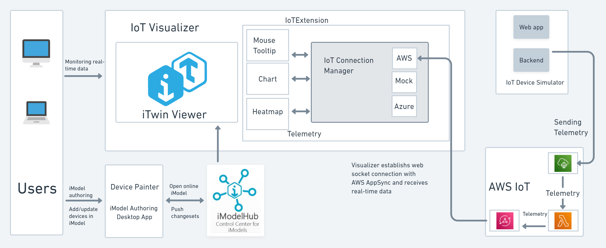

# iTwin IoT Demo with AWS IoT Connection

## Architectural approach

Here is a more detailed architecture explaining various AWS services used for fetching real-time sensor data from AWS IoT Core to iTwin.



1. AWS IoT provides cloud services that connect your IoT devices to other devices and AWS cloud services. AWS IoT provides device software that can help you integrate your IoT devices into AWS IoT-based solutions. If your devices can connect to AWS IoT, AWS IoT can connect them to the cloud services that AWS provides.
2. AWS AppSync provides a robust, scalable GraphQL interface for application developers to combine data from multiple sources, including Amazon DynamoDB, AWS Lambda, and HTTP APIs. We use GraphQL operations like mutation and subscription to send real-time data to the browser through a WebSocket connection created by the GraphQL subscribe operation.
3. AWS Lambda is a compute service that lets you run code without provisioning or managing servers. It is used in combination with AWS AppSync GraphQL operations to broadcast Device-To-Cloud messages to the browser.
4. The IoT Visualizer app is deployed as a Static Website in Cloud.

### More description about AWS IoT connection

The current workflow fetches real-time sensor data from [AWS IoT Core](https://docs.aws.amazon.com/iot/latest/developerguide/what-is-aws-iot.html) using [AWS Lambda](https://docs.aws.amazon.com/lambda/latest/dg/welcome.html) and [AWS AppSync](https://docs.aws.amazon.com/appsync/latest/devguide/what-is-appsync.html).

1. In this project, a Device Simulator is used to send simulated real-time data to AWS IoT Core. There are API Gateway-triggered Lambda functions to query AWS things and send simulated data to AWS IoT Core.
2. Whenever data is received at AWS IoT Core, there is an IoT Core-triggered AWS Lambda function that is responsible for executing a GraphQL mutation with the data received. As a result of this mutation, all the clients that have subscribed to the mutation receive the data.
3. The Visualizer app uses Amplify to connect to the AppSync GraphQL API.
4. Whenever the user wishes to monitor real-time data, the Visualizer (client) calls the GraphQL subscribe method, which subscribes to a GraphQL mutation event. The subscribe method establishes a WebSocket connection through which it receives data whenever a mutation is executed.

## AWS Lambda

This project utilizes AWS Lambda for generating simulated real-time data and sending it to the Visualizer.

### AWS Lambda for IoTService

1. An [AWS IoT-triggered Lambda](./IoTService/aws-lambda/executeAppSyncMutation/index.js) is implemented that is executed whenever a message is sent to the AWS IoT MQTT topic. This function executes a GraphQL mutation operation with the data received at the MQTT topic. The clients that have subscribed to the mutations will receive this data.
2. When running and debugging the AWS Lambda locally, application settings are read from the [template.yaml](./IoTService/aws-lambda/template.yaml). Update this file with the environment variables like AWS region, AppSync GraphQL Endpoint and AWS IoT Policy name(AWS MQTT topic). You will find these variable values from the AWS console after deploying the required resources.

### AWS Lambda for IoTDeviceSimulator

1. An API Gateway-triggered Lambda, [getThings](./IoTDeviceSimulator/aws-lambda/getThings/index.js) is implemented that fetches the list of things from AWS IoT Core.
2. An API Gateway-triggered Lambda, [update-Thing](./IoTDeviceSimulator/aws-lambda/update-Thing/index.js) is implemented that updates the properties of things in AWS IoT Core.
3. An API Gateway-triggered Lambda, [d2c-simulator](./IoTDeviceSimulator/aws-lambda/d2c-simulator/index.js) is implemented that is responsible for sending simulated real-time data to AWS IoT Core.
4. When running and debugging the AWS Lambda locally, application settings are read from the [template.yaml](./IoTDeviceSimulator/aws-lambda/template.yaml). Update this file with the required environment variables. You will find these variable values from the AWS console.

## Prerequisites

This code is tested and run on Windows 10.

You will also need to download and install the following software on your machine.

1.1 Required materials

[Node.js](https://nodejs.org/) (LTS version):
This tool provides the backend JavaScript runtime necessary for your computer to read and render code appropriately. It also allows you to run the NPM command line (required for every iTwin project).

[Git](https://git-scm.com/downloads):
This is the source code control system for the iTwin repositories.

AWS Account:
If you do not have an AWS account create one for free [here](https://portal.aws.amazon.com/billing/signup#/start/email).

AWS CLI:
To install AWS CLI, look [here](https://docs.aws.amazon.com/cli/latest/userguide/getting-started-install.html#getting-started-install-instructions).

Steps to configure AWS CLI :

- Go to the security credentials page in the AWS account.
- In the Access Keys section click on create a new access key, you will get the access key Id and secret access key. Make sure to download or save these credentials somewhere because they will be visible only once.
- In the command prompt type:

    ```properties
    aws configure
    AWS Access Key ID [None]: <Access Key ID>
    AWS Secret Access Key [None]: <Secret Access Key>
    Default region name [None]: <Select your region>
    Default output format [None]: json
    ```

    Enter the saved credentials when prompted.

AWS toolkit:
Install the AWS toolkit in VS Code.

SAM CLI:
Install SAM CLI from [here](https://docs.aws.amazon.com/serverless-application-model/latest/developerguide/serverless-sam-cli-install-windows.html).
It is required to deploy the Lambda function.

Docker:
Required to run the Lambda function locally.

1.2 Suggested materials

[Google Chrome](https://www.google.com/chrome/):
This software can help you to develop and debug frontend JavaScript applications.

[Visual Studio Code](https://code.visualstudio.com/):
This is our recommended editor and debugger tool for developing iTwin.js applications. It is free, open source and includes a GUI for working with GIT. 
## Creating and Deploying AWS Resources

### Create an AWS IoT Thing

1. Log in to AWS Console. Under Services, Go to IoT Core.
2. In the IoT Core Home. Go to Manage -> AllThings -> Things.
3. Click on Create things -> Create single thing.
4. Enter Thing name, select Thing type, and add Non-Searchable thing attributes for the thing named:  Phenomenon, Unit, isRunning, Amplitude, Mean, TelemetrySendInterval, ValueIsBool, Behaviour, Noise_magnitude, NoiseSd, Sine_period, which can be treated as device properties.
5. Click on Next -> Auto-generate a new certificate (recommended).
6. Click on Next and Create policy if you do not have one. Remember this policy name, as it will be used as the MQTT topic for IoT messages, and once a policy is created you can use the same policy for all your devices so that they can communicate through the same MQTT topic.
7. To Create a policy, click on Create policy.
8. Enter a Policy name -> Under Policy action select * -> under Policy resource enter * and click on Create. Attach this policy to your IoT Thing -> Create thing.
9. Certificate files will be generated. Download and save all of them to be used later.
10. Now, the first AWS Thing is created.

### Create an AppSync API

1. Log in to AWS Console. Under Services, Go to AppSync.
2. Click on Create API -> Build from scratch -> Start.
3. Enter an API name -> Create.
4. After creation, Click on Edit Schema -> paste the data from [schema.graphql](./IoTService/aws-lambda/schema.graphql) to the editor -> Save Schema.
5. Go to Settings -> Under Additional authorization providers -> New -> Select Authorization mode as AWS Identity and Access Management -> Submit -> Save.
6. Next Go to Data Sources -> Create data source -> Give a name and Select Data source type as None -> Create.
7. Go to Schema and on the right side, you will find an Attach button under Mutation. Click on Attach.
8. Under Actions -> Update Runtime and in the dropdown Select Unit Resolver(VTL only) and Save.
9. Select the newly created data source name and then under Configure the request mapping template, replace the contents with the code below:

    ```
        {
            "version": "2017-02-28",
            "payload": {
                "name": "$context.arguments.name",
                "data": $util.toJson($context.arguments.data)
            }
        }
    ```

10. Click on Save resolver.
11. The AppSync API is created.

### Create Lambda function for AppSync

1. Go to [./IoTService/aws-lambda](./IoTService/aws-lambda).
2. In the [template.yaml](./IoTService/aws-lambda/template.yaml) file, under environment variables enter the AppSync GraphQL Endpoint URL, AWS IoT Policy name and Resource region. This information is available in the settings of the AppSync resource created. There is a Timeout property in the template, you can enter time in seconds to specify how much time your lambda will execute. The Timeout should not exceed a maximum of 900 seconds.
3. In the [./IoTService/aws-lambda](./IoTService/aws-lambda) terminal enter :

    ```properties
    sam deploy --guided
    Looking for config file [samconfig.toml] :  Not found

        Setting default arguments for 'sam deploy'
        =========================================
        Stack Name [sam-app]: executeAppSyncMutation
        AWS Region [ap-south-1]:<you can choose the AWS region you want to deploy the lambda function>
        #Shows you resources changes to be deployed and require a 'Y' to initiate deploy
        Confirm changes before deploy [y/N]: y
        #SAM needs permission to be able to create roles to connect to the resources in your template
        Allow SAM CLI IAM role creation [Y/n]: y
        #Preserves the state of previously provisioned resources when an operation fails
        Disable rollback [y/N]: y
        Save arguments to configuration file [Y/n]: y
        SAM configuration file [samconfig.toml]:
        SAM configuration environment [default]:
    ```

4. The Lambda function is deployed.
5. In the AWS console, go to the Lambda function just created and in the Configurations tab -> Permissions -> click on the Role name.
6. Once you go to the IAM roles section, Click on Add Permissions-> Create inline policy.
7. In Service Choose AppSync.
8. Under Actions, Check the All AppSync actions (appsync:*) checkbox.
9. Under Resources, Click on All Resources.
10. Review Policy-> Enter a name for the policy -> Create Policy.

### Create an AWS IoT Rule

1. Log in to AWS Console. Go to AWS IoT core.
2. In the IoT Core Home, go to Manage -> MessageRouting -> Rules.
3. Click on Create rule -> Enter Rule name -> Next.
4. Modify the query statement so that it looks like this:  

    ```properties
    select * from '<Topic Filter>' 
    ```

    Here, the topic filter is the name of the policy created and attached to the IoT thing.
5. Under Rule actions -> Select Lambda.
6. Select the Lambda function executeAppSyncMutation that was created earlier.
7. Click on Next -> Create.
8. The AWS IoT rule is created.
9. Once the rule is created, copy the rule ARN and go to the Lambda function for AppSync.
10. Under Configuration->Permissions, scroll down to Resource-based policy statements -> Add permissions.
11. Choose AWS service.
12. In the Service dropdown select AWS IoT.
13. Enter a statement Id and paste the rule ARN in the Source ARN section.
14. Under Action Select lambda:InvokeFunction.
15. Click on Save.

### Create Lambda Function for API Gateway

1. Go to  [./IoTDeviceSimulator/aws-lambda](./IoTDeviceSimulator/aws-lambda/).
2. In the [template.yaml](./IoTDeviceSimulator/aws-lambda/template.yaml) file, there are three lambda function templates present i.e getThingsFunction, d2cSimulatorFunction, and updateThingFunction. Fill in the required environment variables for each function template following the below instructions:

    AWS_RESOURCE_REGION: "The region where your AWS resources will be deployed. e.g: ap-south-1". 

    AWS_IOT_CONNECTION_ENDPOINT: "AWS IoT core endpoint present under Settings of IoT core in AWS console". 

    AWS_MQTT_TOPIC: "The name of policy used while creating AWS IoT things".

3. In the [./IoTDeviceSimulator/aws-lambda](./IoTDeviceSimulator/aws-lambda/) terminal enter :

    ```properties
    sam deploy --guided
    Looking for config file [samconfig.toml] :  Not found

        Setting default arguments for 'sam deploy'
        =========================================
        Stack Name [sam-app]: simulatorLambdaFunctions
        AWS Region [ap-south-1]: <you can choose the AWS region you want to deploy the lambda function>
        #Shows you resources changes to be deployed and require a 'Y' to initiate deploy
        Confirm changes before deploy [y/N]: y
        #SAM needs permission to be able to create roles to connect to the resources in your template
        Allow SAM CLI IAM role creation [Y/n]: y
        #Preserves the state of previously provisioned resources when an operation fails
        Disable rollback [y/N]: y
        Save arguments to configuration file [Y/n]: y
        SAM configuration file [samconfig.toml]:
        SAM configuration environment [default]:
    ```

4. Three Lambda functions will be deployed. For each Lambda function, follow the below instructions to allow access to the AWS IoT core.
5. In the AWS console go to the Lambda function just created, and in the Configurations tab -> Permissions tab -> Click on the Role name.
6. Once you go to the IAM roles section click on Add Permissions-> Create inline policy.
7. In Service Choose IoT.
8. Under Actions, Check the All IoT actions (iot:*) checkbox.
9. Under Resources, Click on All Resources.
10. Review Policy-> Enter a name for the policy -> Create Policy.

### Create an API Gateway resource

1. Log in to AWS Console. Go to API Gateway services.
2. Click on Create API.
3. Select Rest API -> Build.
4. Select REST -> New API -> Enter name of API -> Create API.
5. Go to Actions -> Create a Resource.
6. Enter Resource Name as "getthings" -> Create Resource. Click on the newly created Resource -> Under Actions -> Create Method -> Select GET.
7. Select Lambda -> Enter the name of the getThings Lambda function created.
8. To secure the API Gateway, Go to GET -> Method Request -> Set API Key Required to true.
9. To avoid a CORS error, Click on the GET Method -> Under Actions go to Enable CORS. Click on Enable CORS and replace existing CORS headers.
10. Under Actions click on Deploy API and create a stage if you don't already have one and select that for deployment.
11. Repeat steps 5 to 10 for two more lambda functions. The modification in steps is as follows: 
    
    d2cSimulator:
    - In step 6, the name of the resource should be "d2csimulator" and Select the POST method.
    - In step 7, Enter the name of the d2csimulator Lambda function.
    - In steps 8 and 9, select POST Method. 
    - Under Integration Request -> HTTP Headers, add a header named *X-Amz-Invocation-Type* with a value *'Event'* (with the single quote). This is done so that the API request can return a response without waiting for the Lambda to execute, as Lambda may run for long time depending on how long the user wishes to monitor data.

    updateThings:
    - In step 6, the name of the resource should be "updatethings" and Select the POST method.
    - In step 7, Enter the name of the updatethings Lambda function.
    - In steps 8 and 9, select POST Method.
12. Follow these steps to know the procedure to generate API Keys for API Gateway:
    1. In the API Gateway home page, select the newly created API resource and go to API Keys.
    2. Under Actions, click on Create API Key.
    3. Enter a name -> Click on Save.
    4. On the API Gateway home page, Select Usage Plans.
    5. Select Create -> Fill in the details as per your requirement -> Next.
    6. Click on Add API Stage and select the API created -> Click on Next.
    7. Select Add API Key to Usage Plan -> Enter the name of the API key just created.
    8. The API Gateway is now secured with API Key.
    For more details on how to create API Keys, refer to [this](https://www.youtube.com/watch?v=V-ac_ZvdAW4).  
13. The API Gateway is created and active. Make sure to click on Deploy API, after every modification you do to the resources or methods.

## Running the code locally

To run any of the Lambda functions locally, the environment variables need to be filled in the template.yaml file.
Use the following command in the folder where template.yaml file exists.

```sam local invoke --event <path of event.json>  <name of lambda resource>```

e.g. to run the get-things function locally, navigate to [aws-lambda](./IoTDeviceSimulator/aws-lambda/) and run the command

```sam local invoke --event ./getThings/events.json getThingsFunction```

The contents of the events.json file denote the data passed as input to the Lambda function. Note that running the Lambda functions locally requires a docker instance running on your machine.

## Troubleshooting

1. If after running the Visualizer and Simulator, data is not seen in the Visualizer, check for your AWS Appsync API key in the AWS console. This key expires by default in 7 days, you need to set the expiry date according to your convenience by using the Edit button in the settings of the AWS AppSync page. Make sure to use the valid API Key in your Visualizer environment variables to be able to see data in the viewer.
2. If the console shows a CORS error or the devices are not loaded in Simulator, make sure to enable cors for the API Gateway resources as mentioned [here](./AWSResourceGuideline.md#create-an-api-gateway-resource). Click on Deploy API after each change made to any of the resources.
