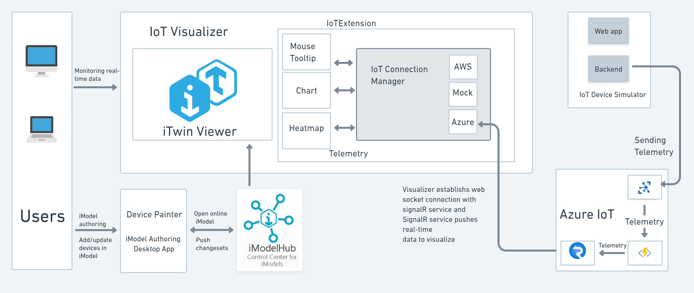

# iTwin IoT Demo with Azure IoT Connection

## Architectural approach

Here is a more detailed architecture explaining various Azure services used for fetching real-time sensor data from Azure IoT Hub to iTwin.




1. Azure IoT Hub is a managed service that acts as a central message hub for communication between your IoT application and the devices it manages. 
2. Azure SignalR Service lets you easily add real-time functionality to your application. It is a fully managed real-time messaging platform that supports WebSockets. 
3. Azure Function is a serverless platform that lets you run your code without managing any infrastructure for the backend. It is used in combination with Azure SignalR Service to broadcast Device-To-Cloud messages to the browser. 
4. The IoT Visualizer app is deployed as a Static Website in Azure Storage.

### More description about Azure IoT connection

The current workflow fetches real-time sensor data from [Azure IoT Hub](https://docs.microsoft.com/en-us/azure/iot-hub/) using [Azure Function](https://docs.microsoft.com/en-us/azure/azure-functions/) and [Azure SignalR service](https://docs.microsoft.com/en-us/azure/azure-signalr/).


1. In this project, a Device Simulator is used to send simulated real-time data to Azure IoT Hub. There are HTTP-triggered Azure functions to query device twins in Azure IoT Hub and send simulated data to Azure IoT Hub.
2. IoT Service has an Azure function that has input binding as IoT Hub and output binding as SignalR service. Whenever data is received at Azure IoT Hub from the Simulator, this function gets triggered and sends data to SignalR service.
3. The Visualizer app calls negotiate endpoint to establish a WebSocket connection with SignalR. This function is named negotiate as the SignalR client requires an endpoint that ends in /negotiate. The negotiate endpoint returns the connection information to the client. The SignalR client will use this information to connect to the SignalR Service instance.
4. Whenever the user wishes to monitor real-time data, the Visualizer (client) uses the [connection object](./IoTVisualizer/src/IoTExtension/IoTConnection/AzureConnection.ts#l12) to listen to the data sent by SignalR.

## Azure Functions

This project utilizes HTTP trigger and Azure IoT Hub trigger for implementing Azure functions.

### Azure Functions for IoTService

1. An [IoT Hub triggered function](./IoTService/IoTHub_EventHub/index.js) is implemented which has input binding as IoT hub built-in endpoint and the output binding as SignalR service.
2. An HTTP-triggered function named [negotiate](./IoTService/azure-functions/negotiate/index.js) is implemented, which is called by the Visualizer client to establish a WebSocket connection with the SignalR service.
3. When running and debugging Azure Functions locally, application settings are read from [local.settings.json](./IoTService/azure-functions/local.settings.json). Update this file with the connection strings of the SignalR Service instance, storage account and the IoT Hub built-in endpoint. You will find these connection strings from Azure Portal.

### Azure Functions for IoTDeviceSimulator

1. An Http-triggered function, [get-deviceTwins](./IoTDeviceSimulator/azure-functions/get-deviceTwins/index.js) is implemented that fetches the list of device twins from the Azure IoT hub.
2. An Http-triggered function, [create-device](./IoTDeviceSimulator/azure-functions/create-device/index.js) is implemented that can be called to add new devices to Azure IoT Hub.
3. An Http-triggered function, [update-deviceTwin](./IoTDeviceSimulator/azure-functions/update-deviceTwin/index.js) is implemented that updates the properties of devices in Azure IoT Hub.
4. An Http-triggered function, [d2c-Simulator](./IoTDeviceSimulator/azure-functions/d2c-simulator/index.js) is implemented that is responsible for sending simulated real-time data to Azure IoT Hub.
5. An Http-triggered function, [c2d-simulator](./IoTDeviceSimulator/azure-functions/c2d-simulator/index.js) is implemented that stops sending real-time data to Azure IoT Hub.
6. When running and debugging Azure Functions locally, application settings are read from [local.settings.json](./IoTDeviceSimulator/azure-functions/local.settings.json). Update this file with the iothubowner connection string and azure storage account connection string. You will find these connection strings from Azure Portal.

Follow [this](https://docs.microsoft.com/en-us/azure/azure-functions/create-first-function-vs-code-node) to know more about developing Azure functions using Visual Studio Code.
Follow [this](https://docs.microsoft.com/en-us/azure/azure-functions/functions-develop-vs-code?tabs=nodejs#generated-project-files) to know more about generated project files in Azure functions.

## Prerequisites

This code is tested and run on Windows 10.

You will also need to download and install the following software on your machine.

1.1 Required materials

[Node.js](https://nodejs.org/) (LTS version):
This tool provides the backend JavaScript runtime necessary for your computer to read and render code appropriately. It also allows you to run the NPM command line (required for every iTwin project).

[Git](https://git-scm.com/downloads):
This is the source code control system for the iTwin repositories.

Azure subscription:
If you don't have an Azure subscription, [create one for free](https://azure.microsoft.com/free/?WT.mc_id=A261C142F) before you begin.

Azure CLI:
You have two options for running Azure CLI commands. Use the Azure Cloud Shell, an interactive shell that runs CLI commands in your browser. This option is recommended because you don't need to install anything. If you're using Cloud Shell for the first time, log into the [Azure portal](https://portal.azure.com/). Follow the steps in [Cloud Shell quickstart](https://docs.microsoft.com/en-us/azure/cloud-shell/quickstart) to Start Cloud Shell and Select the Bash environment. Optionally, run Azure CLI on your local machine. If Azure CLI is already installed, run az upgrade to upgrade the CLI and extensions to the current version. To install Azure CLI, see [Install Azure CLI](https://docs.microsoft.com/en-us/cli/azure/install-azure-cli).

1.2 Suggested materials

[Google Chrome](https://www.google.com/chrome/):
This software can help you to develop and debug frontend JavaScript applications.

[Visual Studio Code](https://code.visualstudio.com/):
This is our recommended editor and debugger tool for developing iTwin.js applications. It is free, open source and includes a GUI for working with GIT. Install Azure Functions and Azure Storage extensions.

## Deployments of Resources in Azure

Add your azure subscription name in [deploy.azcli](./DevOps/Azure/deploy.azcli).

Run the deploy.azcli from the [Bash shell](https://www.infoworld.com/article/3178631/discover-the-power-of-bash-on-windows.html). If you don't have Bash shell setup on your machine, refer to [this](https://hackernoon.com/how-to-install-bash-on-windows-10-lqb73yj3).

```properties
./deploy.azcli
```

These deployment steps should create a Function App, SignalR service instance, storage account and IoT Hub instance in Azure. This will also create a device in the IoT hub and print the device connection string. Copy this connection string as it would be used in the next step.

## Azure IoT Hub setup and device simulation

Follow [this](https://docs.microsoft.com/en-us/azure/iot-develop/quickstart-send-telemetry-iot-hub?pivots=programming-language-nodejs) tutorial to send telemetry from a device to Azure IoT Hub.

Refer to [this](https://docs.microsoft.com/en-us/azure/iot-develop/quickstart-send-telemetry-iot-hub?pivots=programming-language-nodejs#run-the-device-sample) to run the Node.js SDK device sample to send messages from a device to your IoT hub.

We have built a [custom simulator](IoTDeviceSimulator) using the above Node.js SDK for device simulation.

### Raspberry Pi Azure IoT online Simulator

For a quick testing, the [Raspberry Pi Online simulator](https://azure-samples.github.io/raspberry-pi-web-simulator/#getstarted) can also be used to send simulated IoT data to Azure IoT Hub.
In the online simulator, you can alter the code and add your IoT Hub connection string and modify the message body as shown:
```
{
        messageId: messageId,
        deviceId: '[your device id]',
        data: data.temperature_C,
        timeStamp: (new Date(Date.now())).toString()
}
```
Click on Run and try to monitor data in the IoT Visualizer.

## Running the code locally

Press F5 in Visual Studio Code to start the [function app project](./IoTService/). Refer to [this](https://docs.microsoft.com/en-us/azure/azure-functions/create-first-function-vs-code-node#run-the-function-locally) document to know more about locally running function apps.

Build the Visualizer app. Go to the [IoTVisualizer](./IoTVisualizer) root directory and run the following command.

```properties
npm run build
```

Run the following command from the Visualizer app project's root directory (i.e. [IoTVisualizer](./IoTVisualizer)) to start the web app.

```properties
npm start build
```

## Running the code from Azure

To deploy the Function App to Azure, enter 'Azure Functions: Deploy to Function App' in the VS Code Command Palette and select the Function App we created earlier. If you haven't used Command Palette earlier in VS Code, the most important key combination to know is Ctrl+Shift+P, which brings up the Command Palette. Make sure to click on Upload Settings when VS Code prompts it after the function app deployment is done. When the deployment is done you can get the URL of the negotiate function in the Output window of VS Code. Copy this value (without ‘/negotiate’) and set it to connectionUrl1 in the [IotVisualizerConfiguration.json](./IoTVisualizer/src/IoTExtension/IotVisualizerConfiguration.json) file. For local testing, the URL will be "/api".

For this code sample, the App Service Authentication is disabled in the function app.

Before deploying the IoTVisualizer app to Azure, make sure that [signin-callback](./IoTVisualizer/public/signin-callback/index.html) page has client_id and scope values added. Now go to 'Azure Storage: Deploy to Static Website via Azure Storage' in the VS Code Command Palette and select the build folder to deploy. Next, select the Azure subscription and then select the Azure storage account that you created earlier.

Now let’s go back to our iTwin App’s registration page on [My Apps | iTwin Platform](https://developer.bentley.com/my-apps/) and add redirects for our app. As mentioned earlier we already know where our app will be deployed, so go back and copy the URL if you need to. Add both a Redirect and Post logout redirect for your app, with the base URL matching where our app will be deployed (e.g. these URLs could be added against your Redirect Uri - "https://mybentleyiotdemo.net/signin-callback", "https://mybentleyiotdemo.net/". Here "https://mybentleyiotdemo.net/" is your Primary endpoint for the static website hosted in the Azure Storage account. Your URLs could be different than these). Once ready hit “Save”. Note that it can take up to 10 minutes or so for these changes to take effect.

Once the deployment is done, run the Visualizer app and it should start showing up the real-time data.

## Troubleshooting

1. If after deploying to Azure, the Visualizer still doesn't show any live data then try changing these configuration settings in the function app. Modify General Settings in the function app. Change Node.js Version to Node.js 14 LTS in General Settings. Modify the Function runtime settings. Change the runtime version to ~3 in the Function runtime settings.

2. Check if the Url variable in index.html is set to function app URL (something like https://mybentleyiotdemo-funcapp.net/api). This URL you would find in Function App's Overview blade.

3. Check if you have entered the correct values for AzureSignalRConnectionString, AzureWebJobsStorage, and IoTHubConnection in Function App -> Configuration -> Application Settings. If these values have been correctly entered in local.settings.json, then while deploying, the Function App resource in Azure already takes the correct values.

4. If the function app gives any error running locally, check if the consumerGroup name is provided in [function.json](./IoTService/azure-functions/IoTHub_EventHub/function.json).

5. For the local run of the IoT Visualizer app and IoT Service, if sensor data is not showing up in the Visualizer app, the Visualizer app might not be getting connected to signalR service. Check in the browser console logs, if it is failing because of a CORS error. In this case, add the Visualizer app's local hosting address in the CORS entry in [local.settings.json](./IoTService/azure-functions/local.settings.json).
