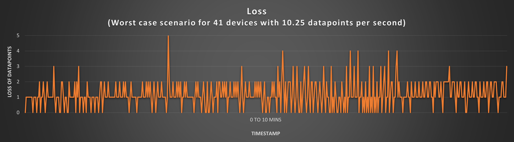

# Data Throughput Analysis

1. Introduction:

    This experiment was conducted to test the data throughput scalability of the IoT Demo architecture.  While varying the quantity of data, we measured the number of data points sent from the Device Simulator to Azure IoT Hub and compared with the number of data points received by the IoT Visualizer.  We found that the architecture can support 4.1 data points per second with
    zero data loss.  At 5.1 data points per second we measured a data loss of less than 1%.

    This experiment used the basic tier service plans for all relevant services.  It is expected that higher tier service plans would enable higher data throughput.

2. Description:

    In all cases the simulator was started with 41 devices.  For 10 minutes we logged all the data points sent from the simulator and we also logged all the data points received by the visualizer.  This set up was repeated four times for data periods of 10 sec, 8 sec, 6 sec and 4 sec.  For each repetition, all the devices were configured to the selected data period.

    Service plans used:

    - SignalR: free tier (1 unit).
    - Azure IoT hub:  S1 Standard tier (2 units).
    - Azure Functions for simulator and service: Consumption plan.

3. Results:

    | Data period (seconds) | Average datapoints per second | Loss percent
    |-----------------------|-------------------------------|------------|
    |10    |4.1       |0
    |8     |5.125     |0.237
    |6     |6.833     |6.22
    |4     |10.25     |11.508

    Loss = (No. of data points generated by simulator – No. of data points collected by visualizer)

    Loss percent = (Loss * 100) / No. of data points generated by simulator

     

4. Summary:

  - For 4.1 data points per second no loss was observed and for 10.25 data points per second 10% loss was observed. Hence higher data frequency resulted in higher data  loss with the same tier.
  - To avoid data loss, the following minimum periods are therefore recommended:

    | No. of devices | Minimum period(seconds)
    |----------------|-----------------------|
    |10000           |2500
    |1000            |250
    |100             |25
    |41              |10

  For more devices or for higher frequencies, a higher tier of Azure services can be utilized.
