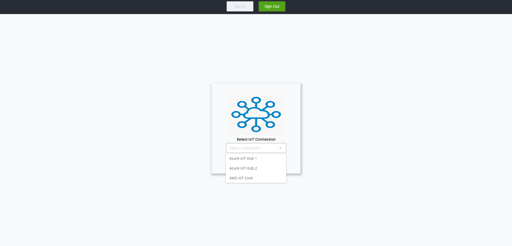
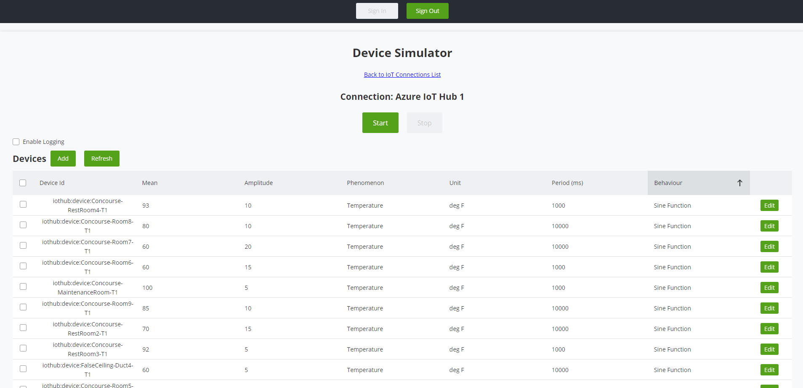
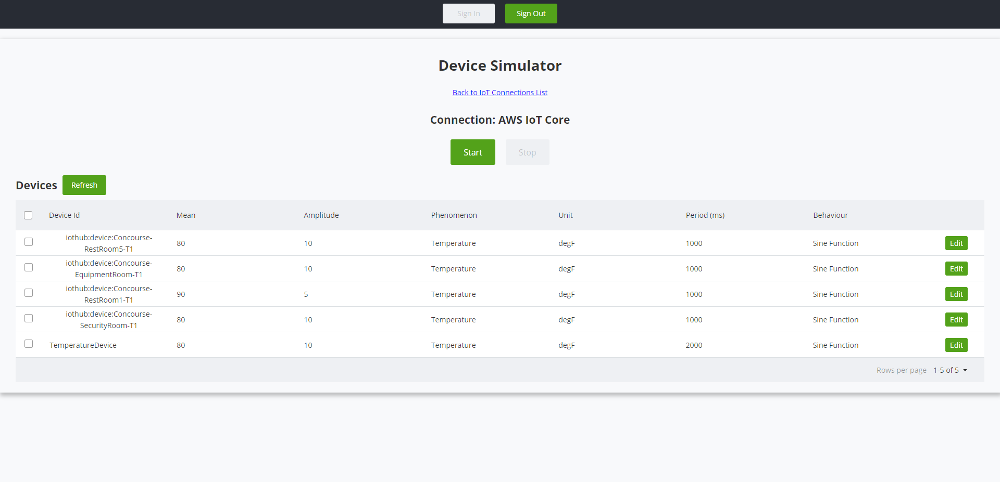
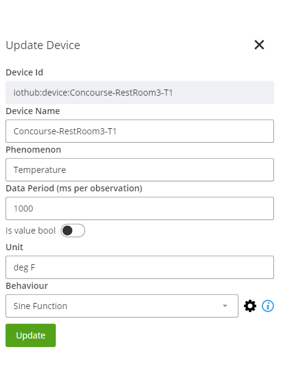
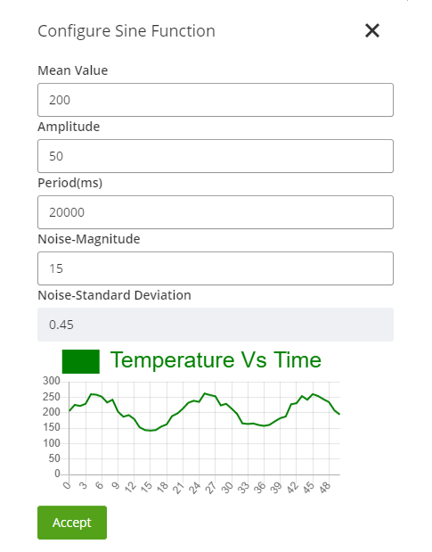

# IoT Device Simulator

[IoT Device Simulator](../IoTDeviceSimulator/) generates simulated sensor data. There is a [Simulator portal](./web-client/) from where devices can be added or updated. The Simulator can also be started or stopped from the portal. All the corresponding APIs for running the Simulator or communicating with the cloud services are defined in [azure-functions](./azure-functions/) or [aws-lambda](./aws-lambda/) folders.

The Device Simulator has the following features :
- A common portal for multiple connections, where required IoT connection can be chosen. (Fig. 1)
- Display a list of devices from an IoT connection. (Fig. 2 and Fig. 3)
- Add/Update a device in the IoT connection. (Fig. 4)
- Configure the device behaviour. (Fig. 5)

Following are the snapshots taken from Device Simulator showing its various components.

|  |
|:--:|
| <b>Fig. 1 List of IoT connections</b> |

|  |
|:--:|
| <b>Fig. 2 List of devices from Azure IoT Hub</b> |

|  |
|:--:|
| <b>Fig. 3 List of devices from AWS IoT Core</b> |

|  |      |  |
|:--:|:--:|:--:|
| <b>Fig. 4 Dialog to update device properties</b> |      | <b>Fig. 5 Dialog to configure device behaviour</b> |


## Initial Setup

### Environment Variables

Prior to running the app, you will need to add OIDC client configuration to the variables in the [.env](./web-client/.env) file:

```text
# ---- Authorization Client Settings ----
REACT_APP_CLIENT_ID = ""
REACT_APP_REDIRECT_URI = ""
REACT_APP_LOGOUT_URI = ""
REACT_APP_CLIENT_SCOPES = ""
REACT_APP_AUTHORITY=""
SKIP_PREFLIGHT_CHECK=true
```

- You can generate a [test client](https://developer.bentley.com/tutorials/web-application-quick-start/#2-register-an-application) to get started.
- Make sure to select appropriate scopes while creating a test client. The scopes required for Device Simulator client app are : users:read

- When you are ready to build a production application, [register here](https://developer.bentley.com/register/).

```text
REACT_APP_FUNCTION_URL = ""
REACT_APP_AZURE_STORAGE_SAS_URL=""
```

- The Function app URL is the Azure function URL for Simulator Azure functions appended with /api. You can find it in the Azure portal under your Simulator function app.
- REACT_APP_AZURE_STORAGE_SAS_URL - Azure storage SAS URL

***Note: This project uses Azure blob storage for storing configuration files. If you wish to use only AWS resources, the S3 bucket can be used as a storage location instead of the Azure storage account.***

If an AWS IoT connection is to be used, the environment variables mentioned below need to be filled, or else these can be left empty.

```text
REACT_APP_AWS_API_GATEWAY_APIKEY=""
REACT_APP_AWS_API_GATEWAY_URL=""
```

- REACT_APP_AWS_API_GATEWAY_APIKEY - API Key of AWS API gateway
- REACT_APP_AWS_API_GATEWAY_URL - Stage URL of AWS API gateway


### Additional Setup Guidelines

Make sure the cloud services being used have all the required resources deployed. If not done yet, follow the instructions from the below links depending on the cloud service (Azure/AWS) opted for:

- [Azure resource deployment](../AzureConnectionGuidelines.md#deployments-of-resources-in-azure)
- [AWS resource deployment](../AWSConnectionGuidelines.md#creating-and-deploying-aws-resources)

***Note: The below steps for creating an Azure storage container can be replaced with S3 bucket usage if only AWS services are intended to be used***

The next step is to create an [Azure storage container](https://learn.microsoft.com/en-us/azure/storage/blobs/storage-blobs-introduction#containers) named iot-demo-configuration in Azure storage to store files that contain configuration and authorization data.

Follow this [link](https://learn.microsoft.com/en-us/azure/storage/blobs/storage-quickstart-blobs-portal#create-a-container) to create a container in Azure blob storage. 

You can upload the files [IotDeviceSimulatorConfiguration](./web-client/src/IotDeviceSimulatorConfiguration.json) and [UserAuthorization](./web-client/src/UserAuthorization.json) to the Azure storage container. Make sure to fill in the empty spaces in these files according to the instructions provided below. [Do not change the names of the files and the Azure storage container]. If UserAuthorization.json is already present in your blob storage, do not upload a new one.
 

IotDeviceSimulatorConfiguration File : [IotDeviceSimulatorConfigurationFile](./web-client/src/IotDeviceSimulatorConfiguration.json)

```json
# ---- Connections ---

"connections":[
    {
        "id":"1",
        "type":"Azure",
        "name":"",
        "IoTHubConnectionStringId":"IOT_HUB_CONNECTION_STRING"   //Key to the IotHubConnection string property in Configuration of function app
    }
	]

# ---- Duration ---

"duration":""                                                    //This denotes the duration after which the simulator would automatically shut down and stop sending data to Azure IoT Hub
```


UserAuthorization File : [UserAuthorizationFile](./web-client/src/UserAuthorization.json)

```json
# ---- Roles ---

"Roles":[
	{
		"Role":"Admin",
		"emailIds":[                                             //Add the email Ids of users that can have admin permissions which include using all functionalities of simulator and visualizer along with adding/editing devices in simulator				
		]
	},
	{
		"Role":"User",
		"emailIds":[                                             //Add the email Ids of users that can have user permissions which include using all functionalities except adding/editing devices in simulator																
		]
	}
	]
```

## Testing

Testing is done for Azure/AWS IoT connection with IoT data sent from devices in a Device Simulator. The simulated devices are connected to Azure/AWS IoT systems. It is not yet tested with any real devices. 

Once all the applications are deployed. Please follow the below steps to make sure the apps are working as expected.

### Device Simulator

1. Once the user has clicked on signin, they should see the dropdown page with a list of connections.
2. Once the user selects a connection, a page with the device list should be loaded.
3. If the user has admin access, they can see an ADD button and an Edit button to modify device properties.
4. If the user has non-admin access, they can only see the View button instead of Edit.
5. To test out the Simulator, the user can check on the Enable logging check box and select some devices from the list, then click on start.
6. If you have started using Visualizer you can also check some real-time monitoring methods to check how the data is represented.
7. After some time, the user can click on the Stop button, and then notice that a .csv file will be downloaded which has data sent out from the simulator.
8. Once the file is downloaded and has the required data, it denotes devices are sending out data as expected.
9. Note: If the user is unauthorized to use the Simulator, they might see an unauthorized error page at the very beginning.

For testing guidelines for the visualizer click [here](../IoTVisualizer/README.md#testing).