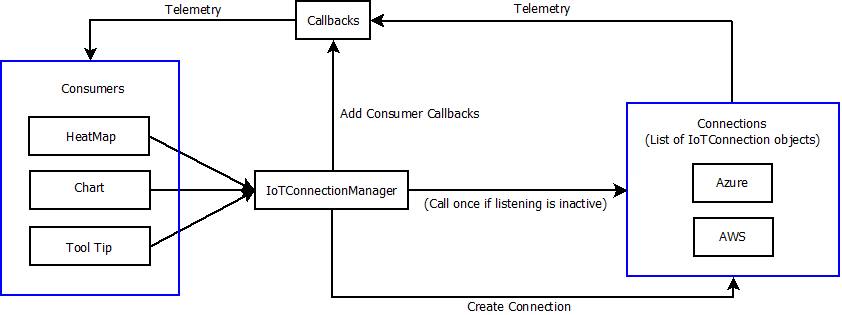
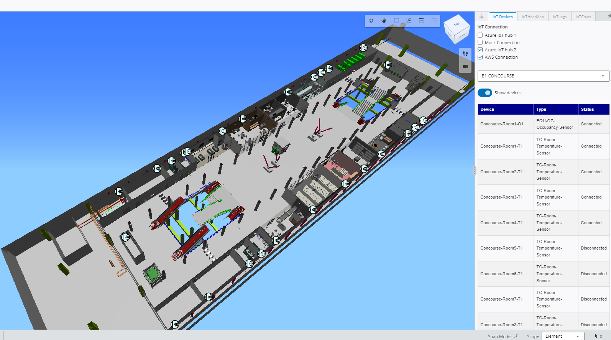
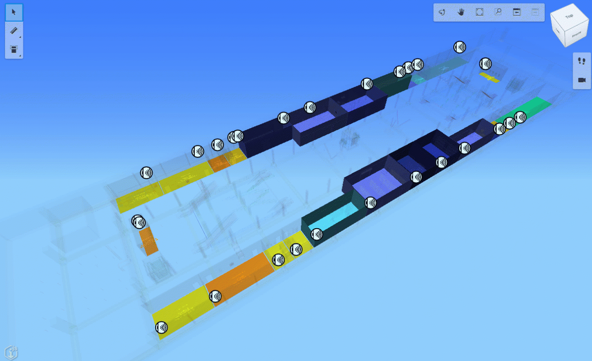
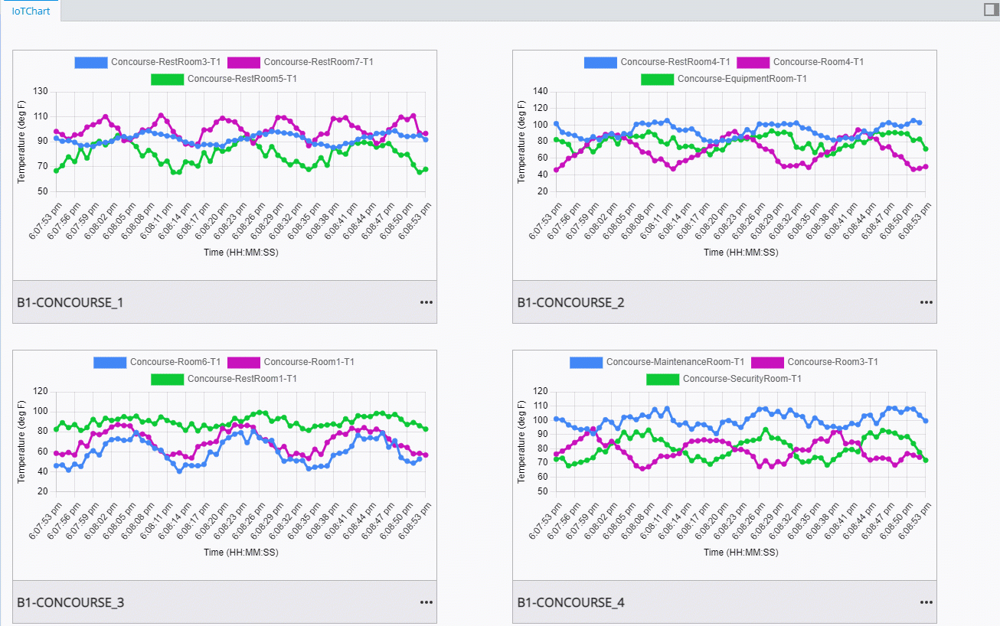
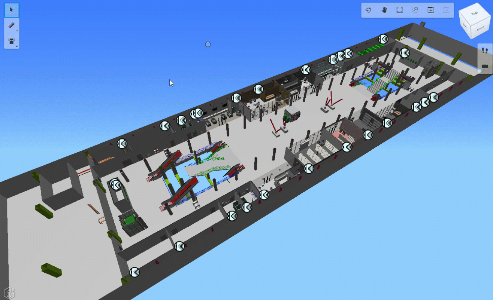

# IoT Visualizer

The IoT Visualizer is a customized iTwin viewer application with an IoT Extension module. If you are new to iTwin Viewer, refer to [this](https://developer.bentley.com/tutorials/itwin-viewer-hello-world/).

The following diagram explains how the different components of the Visualizer i.e [IoTConnection](./src/IoTExtension/IoTConnection/IotConnection.ts), [IoTConnectionManager](./src/IoTExtension/IoTConnection/IoTConnectionManager.ts) and Consumers (i.e. visual monitoring of real-time data) interact with each other.   
    <p align="center"></p> 
  
- The iTwin communicates with the IoT system through the IoTConnectionManager. It establishes the connection to the IoT system when the iTwin app is initialized.
- The IoTConnectionManager also acts as an interface between various IoT connections and consumers.
- The IoTConnectionManager is responsible for handling real-time data requests from consumers. When a consumer requests real-time data, the monitor method in the IoTConnectionManager invokes the listen method of appropriate IoT connection which will take care of providing real-time data.
- The listen method is defined in the IoTConnection class. It is an entry point for real-time data into the iTwin application. The listen method uses a WebSocket connection to receive data.
- The code is optimized in such a way that the monitor method in the IoTConnectionManager makes sure that, for every listen request from consumers, the listen method is not invoked again if it is already receiving data.
- This project demonstrates three ways of visualizing real-time data (i.e [Heat map](./src/IoTExtension/DeviceMonitorUI.tsx#L166), [Chart](./src/IoTExtension/DeviceMonitorUI.tsx#L51) and [Tooltip](./src/IoTExtension/DeviceMonitorUI.tsx#L44)).

  - Heat map: Represents real-time data by color-coding the observed elements. (Fig.2)
  - Chart: Represents real-time data by plotting charts of data points against the time-axis. (Fig.3)    
  - Tooltip: Displays real-time data in a mouse tooltip when the mouse hovers over a device marker. (Fig.4)  


  Following are the snapshots taken from IoT Visualizer showing the Metrostation iModel and visualizing real-time data through heat map, chart and mouse tooltip.

    |  |
    |:--:|
    | <b>Fig. 1 Concourse level of a metro station iModel</b> |

    |  |
    |:--:|
    | <b>Fig. 2 Heatmaps showing up in the concourse level of a metro station iModel</b> |

    |  |
    |:--:|
    | <b>Fig. 3 Charts showing temperature data patterns for concourse-level rooms</b> |

    |  |
    |:--:|
    | <b>Fig. 4 Mouse Tool tips showing temperature data for concourse-level rooms</b> |


## Initial Setup

### Environment Variables

Prior to running the app, you will need to add OIDC client configuration to the variables in the [.env](./.env) file:

```text
# ---- Authorization Client Settings ----
IMJS_AUTH_CLIENT_CLIENT_ID=""
IMJS_AUTH_CLIENT_REDIRECT_URI=""
IMJS_AUTH_CLIENT_LOGOUT_URI=""
IMJS_AUTH_CLIENT_SCOPES =""
IMJS_AUTH_AUTHORITY=""
SKIP_PREFLIGHT_CHECK=true
```

- You can generate a [test client](https://developer.bentley.com/tutorials/web-application-quick-start/#2-register-an-application) to get started.
- Make sure to select appropriate scopes while creating a test client. The scopes required for IoT Visualizer client app are : imodels:read itwinjs imodelaccess:read

- When you are ready to build a production application, [register here](https://developer.bentley.com/register/).

You should also add a valid iTwinId and iModelId for your user in this file:

```text
# ---- Test ids ----
IMJS_ITWIN_ID = ""
IMJS_IMODEL_ID = ""
```

- For the IMJS_ITWIN_ID variable, you can use the id of one of your existing Projects or Assets. You can obtain their ids via the [Administration REST APIs](https://developer.bentley.com/api-groups/administration/api-reference/).

- For the IMJS_IMODEL_ID variable, use the id of an iModel that belongs to the context that you specified in the IMJS_ITWIN_ID variable. You can obtain iModel ids via the [Data Management REST APIs](https://developer.bentley.com/api-groups/data-management/apis/imodels/operations/get-project-or-asset-imodels/).

- Alternatively, you can [generate a test iModel](https://developer.bentley.com/tutorials/web-application-quick-start/#3-create-an-imodel) to get started without an existing iModel.

- If at any time you wish to change the iModel that you are viewing, you can change the values of the iTwinId or iModelId query parameters in the URL (i.e. localhost:3000?contextId=myNewContextId&iModelId=myNewIModelId).

```text
# ---- Azure Settings ----
IMJS_AZURE_STORAGE_SAS_URL=""
```

- We can store Visualizer configuration information in your Azure Storage.
- If you do not already have a storage account, create one by following this [link](https://learn.microsoft.com/en-us/azure/storage/common/storage-account-create?tabs=azure-portal).
- The SAS URL for your storage account can be found inside the Security + Networking -> Shared Access Signature.
- Select All  Allowed Resource Types and click on Generate SAS and Connection String.
- Copy the Blob service SAS URL and use it in the above field.

***Note: This project uses Azure blob storage for storing configuration files. If you wish to use only AWS resources, the S3 bucket can be used as a storage location instead of the Azure storage account.***

If an AWS IoT connection is to be used, the environment variables mentioned below need to be filled, or else these can be left empty.

```text
# ---- AWS Settings ----
IMJS_AWS_API_GATEWAY_APIKEY=""
IMJS_AWS_APPSYNC_APIKEY=""
IMJS_AWS_REGION=""
IMJS_AWS_IOT_MQTT_TOPIC=""
```

- IMJS_AWS_API_GATEWAY_APIKEY - API Key of API Gateway.
- IMJS_AWS_APPSYNC_APIKEY - API Key of AppSync API.
- IMJS_AWS_REGION - AWS Region where resources have been deployed.
- IMJS_AWS_IOT_MQTT_TOPIC - Name of the policy created and attached to IoT things.

### Additional Setup Guidelines

Make sure the cloud services being used have all the required resources deployed. If not done yet, follow the instructions from the below links depending on the cloud service (Azure/AWS) opted for:

- [Azure resource deployment](../AzureConnectionGuidelines.md#deployments-of-resources-in-azure)
- [AWS resource deployment](../AWSConnectionGuidelines.md#creating-and-deploying-aws-resources)

***Note: The below steps for creating an Azure storage container can be replaced with S3 bucket usage if only AWS services are intended to be used.***

The next step is to create an [Azure storage container](https://learn.microsoft.com/en-us/azure/storage/blobs/storage-blobs-introduction#containers) named iot-demo-configuration in Azure storage to store files that contain configuration and authorization data.

Follow this [link](https://learn.microsoft.com/en-us/azure/storage/blobs/storage-quickstart-blobs-portal#create-a-container) to create a container in Azure blob storage.

You can upload the files [IotVisualizerConfiguration.json](./src/IoTExtension/IotVisualizerConfiguration.json) and [UserAuthorization.json](./src/IoTExtension/UserAuthorization.json) to the Azure storage container. Make sure to fill in the empty spaces in these files according to the instructions provided below. [Do not change the names of the files and the Azure container.]

IotVisualizerConfiguration File: [IotVisualizerConfigurationFile](./src/IoTExtension/IotVisualizerConfiguration.json)

```json
# ---- Connections ---

"Connections": [                                             // Specify IoT connections information here
  {
    "id": 1,
    "type": "AZURE_IOT_HUB",
    "name": "",
    "connectionUrl1": "",                                    // Function App URL from IoTService, something like https://fn-owqp7dcbdkba6.azurewebsites.net/api. 
                                                             // This URL you would find in Function App's Overview blade
    "connectionUrl2": "",                                    // The key value assigned to iothubconnection string in simulator function app configuration
                                                             // This is the name of the key in function app configuration that stores the IoTHub connection string
    "key":""                                                 // name of the env variable that stores admin key for the function                                       app                                                         
  },
  {
    "id": 2,
    "type": "MOCK_API_CONNECTION",
    "name": "",
    "connectionUrl1": "",                                    // Connection URL to mock data, something like  https://iotdemostorage1a.z13.web.core.windows.net/ is your 
                                                             //  Primary endpoint for the static website hosted in Azure Storage account
    "connectionUrl2": "",                                    // This is Optional
    "key":""                                                 // This is optional
  }
  {
      "id": 4,
      "type": "AWS",
      "name": "AWS Connection",
      "connectionUrl1": "" ,                                  // App Sync graphql endpoint url,
      "connectionUrl2": "",                                    // API gateway invoke Url
      "key":""                                                // name of the env variable that stores api key for appsync
  }
]

# ---- HeatMap ----

"HeatMap": {
    "types":[],                                              //optional for heatmap
                                                             //set to true or false to enable or disable Heat Map Widget
    "Show":"true",     
                                                             // Set the transparency of non emphasized elements from 0 to 1 while color coding                                      
    "Transparency":"",     
                                                             // user can add any number of phenomenon along with the color to be used for particular range of values                                  
    "colors": [                                              
      {
                                                             //name of the phenomenon
        "phenomenon": "",                                    
        "data": [
          {
            "min": 68,  
            "max": 72.9,
                                                             // color for real Time data ranging from min to max
            "color": "",  
                                                             // unit of data                                   
            "unit": ""                                       
          }
        ]
      },
    ],
    "options":{}                                             //optional for heatmap
  }

# ---- Chart ----

"chart": {
                                                             // user can enter the types of chart that can be plotted
    "types": [ 
    ],      
                                                             //set to true or false to enable or disable Chart Widget                                                 
    "Show": "true",   
                                                             // add different colors to plot chart for each device in required colors, add number of colors same as no. of devices                                       
    "colors": [                                              
    ],
                                                             // input maximum of how many devices can be plotted in a chart
    "NoOfDevicesInChart":"",   
                                                             // input time duration (in seconds) for which the data should be plotted in a chart window                              
    "ChartDuration":"",                                      
    "options": { 
      "animation":{
                                                             // decide whether to allow animation in chart
          "duration":""                                      
      },     
      "scales": {
        "y": {
          "ticks": {
                                                             // decide color for ticks on y axis labels
            "color": ""                                      
          },
          "title": {
                                                             // y axis label, field gets value programmatically
            "text": "",                                      
            "display": true,    
                                                             // decide color for y axis label                              
            "color": ""                                      
          }          
        },
        "x": {
                                                             // set it to time always to plot datapoints against time axis
          "type": "time",                                             
          "ticks": {
                                                             // decide color for ticks on x axis labels
            "color": "",                                     
            "source":""                                   
          },
          "title": {
                                                             // x-axis label
            "text": "Time (HH:MM:SS)",                       
            "display": true,
                                                             //x-axis label color
            "color": ""                                      
          }
          
        }
      }
    } 
  } 

# ---- Logs ----

"Logs": {
                                                            //set to true or false to enable or disable Logs Widget
    "Show": "true",                                          
    "options": {
      "fieldSeparator": "",
      "quoteStrings": "",
      "decimalSeparator": "",
      "showLabels": true,
      "showTitle": true,
      "title": "",
      "useTextFile": false,
      "useBom": true,
      "useKeysAsHeaders": true,
      "filename": ""
    }
  }
  ```

User Authorization File: [UserAuthorizationFile](./src/IoTExtension/UserAuthorization.json)

```json
# ---- Roles ---

"Roles":[
{
 "Role":"Admin",
 "emailIds":[                                             //Add the email Ids of users that can have admin permissions which include using all functionalities of simulator and visualizer along with adding/editing devices in simulator 
 ]
},
{
 "Role":"User",
 "emailIds":[                                             //Add the email Ids of users that can have user permissions which include using all functionalities except adding/editing devices in simulator             
 ]
}
]
```

## Testing

Testing is done for Azure/AWS IoT connection with IoT data sent from devices in a device simulator. The simulated devices are connected to Azure/AWS IoT systems. It is not yet tested with any real devices.

Once all the applications are deployed. Please follow the below steps to make sure the apps are working as expected.

### IoT Visualizer

1. Once the Viewer is loaded, check out the IoT Devices Widget. It should show a list of checkboxes showing the connections and a device list grid.
2. Initially, the status of all devices in the device list should be Disconnected.
3. Once you check on a checkbox, the devices from the respective connection should show the status as Connected.
4. To start monitoring data, make sure the Device Simulator has been started.
5. In the device list, you can click on any connected device, to zoom into the marker placed on the iModel.
6. There are 4 ways for monitoring data

- Hover over the marker and you can see data being shown in a mouse tooltip. You might experience a delay in seeing the data depending upon the period set for that device in the Simulator.
- Go to the IoTHeatMap widget and switch on the Show Heatmap toggle. You might see the radio buttons of the phenomenon being enabled.
          Click on the phenomenon you wish to monitor, and notice that all devices measuring that phenomenon will start color-coding their observed elements in the iModel.
- Go to the IoTChart widget and click on Add New Chart. You can click on the three dots and configure the chart.
          Select a phenomenon and the device measuring that phenomenon from the list. Select the chart type of your choice and click on OK.  
          As the data for that device reaches the Visualizer, you can see the values plotted on the chart.
- Go to the IoTLogs widget, select a connection from the drop-down and click on Start, you should see the data points getting collected and the count displayed on the screen.  
          Once you click on stop, a .csv file should be downloaded with the data collected.

7. In all these four ways of real-time monitoring, notice that the device whose data you are monitoring should show the status as Active in the device list.
8. Please make sure that the devices you are using for monitoring have been started from the Simulator.
9. Once all these steps work fine, the Visualizer is all set for use.
10. Note: If the user is unauthorized to use the Visualizer, you might see an Access Denied error message when you check on the connections.

For testing guidelines for the Simulator click [here](../IoTDeviceSimulator/README.md#testing).
