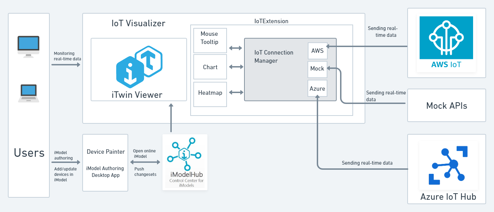

# iTwin IoT Demo

The IoT demo source code is intended to help you get started with IoT data monitoring and visualization in [iTwin Viewer](https://developer.bentley.com/tutorials/itwin-viewer-hello-world/) apps. You will be introduced to a generic approach to fetch real-time sensor data from different IoT systems to an iTwin.

## How monitoring IoT devices in real-time could be useful for end users?

Consider a technician monitoring a facility. It won't be a good user experience if they have to continuously refresh an application's screen to check the status of their equipment. It would be better for the application to show changing data in real time without refreshing the screen, so monitoring would be easy.

## Architectural approach

The following architecture defines an iTwin IoT workflow for fetching real-time data from devices connected to multiple IoT platforms.

In the below diagram, we see an IoT Visualizer which is an iTwin Viewer application customized for visualizing and monitoring real-time sensor data.
It also consists of IoT Extension, which is another module that has a connection manager responsible for connecting with different IoT platforms and UI components that helps visualize and monitor IoT data through mouse tooltips, color-coded heatmaps and charts. 
The objective here is to provide a generic approach to fetch real-time IoT data in iTwin.

For the detailed architecture explaining the system with Azure IoT hub click [here](./AzureConnectionGuidelines.md#architectural-approach).

For the detailed architecture explaining the system with AWS IoT core click [here](./AWSConnectionGuidelines.md#architectural-approach).

## Overview of file structure

1. [IoT Visualizer](./IoTVisualizer/): This folder contains code for the iTwin Viewer application and the IoT Extension module. The [IoT Extension](./IoTVisualizer/src/IoTExtension/) is the parent module that wraps up all the code for the IoT Connection and UI components in one place. The [IoT Connection](./IoTVisualizer/src/IoTExtension/IoTConnection/) module has the connection manager code and any code for a new IoT connection should be put here. 
    
    Refer to [this](./IoTVisualizer/README.md) Readme for more details.

2. [IoT Service](./IoTService/): This folder contains code for Azure Functions or AWS Lambda which get triggered as devices are sending telemetry messages to Azure IoT Hub or AWS IoT Core respectively.

3. [IoT Device Simulator](IoTDeviceSimulator): This folder contains code that generates and sends telemetry messages from devices to Azure IoT Hub/ AWS IoT Core.
    - The [web-client](./IoTDeviceSimulator/web-client/) module consists of code for the simulator web portal.
    - The [azure-functions](./IoTDeviceSimulator/azure-functions/) and [aws-lambda](./IoTDeviceSimulator/aws-lambda/) modules have the serverless backend code for generating real-time sensor data and also querying and modifying devices. 
    
    Refer to [this](./IoTDeviceSimulator/README.md) Readme for more details.

## Data Throughput Analysis

An experiment was conducted to test the performance of this application in terms of scalability, data throughput and recommended data frequencies. Please check out the [Data Throughput Analysis](./DataThroughputAnalysis.md#data-throughput-analysis) document to get details of this experiment.

